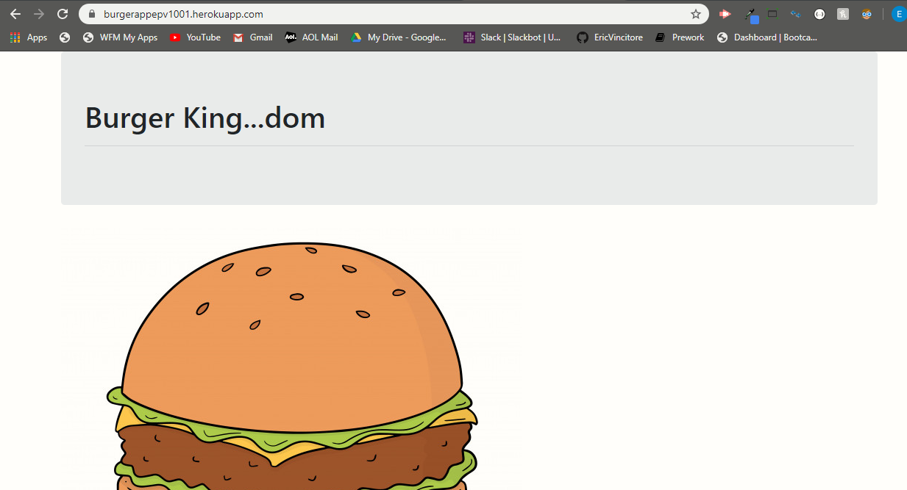
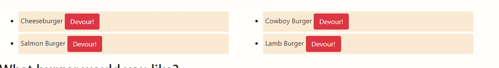
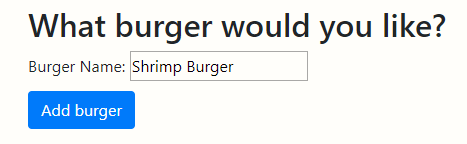
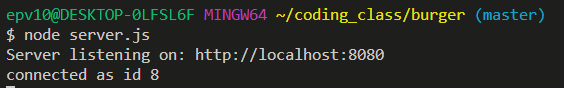

# burger

This app will allow the user to add an item ot the menu and devour it or already existing items.

## Overview

Welcome to the Burger app! This app will allow you to add to an existing menu then devour them. It will show the devoured items on the right of the page and any un-devoured items on the left of the page. At the bottom is an input box to add any item the user would like.

## Instructions

### Heroku Instructions

1. Navigate to the heroku page for the app using the link at the bottom of this README.    
* https://burgerappepv1001.herokuapp.com/

2. You should be redirected to a new page with the current menu options.  

3. Once you have navigated to this page you are able to devour burgers that are currently on the menu using the "Devour!" button to the right of each option. When an item is successfully devoured it will move tot eh right side of the web page.  
* Before Click  
  

* After Click  
  

4. You can also add to the menu by going to the submission box at the bottom of the page. Just type the name of the burger or item you would like to add to the menu and click the "Add Burger" button located below th input box.  

5. After step 4 is successfully completed you will see the new item you added at the bottom of the menu with a devour button to the right of it. When an item is successfully devoured it will move to teh right side of the web page.  

### Git-Hub Instructions

1. After you have pulled the repository navigate to the folder in your terminal and run the following commands to install node and the required dependencies.
    * npn init -y
        * This downloads the node package.
    * npm install 
        * This will install the node package.
    * npm install express
        * This will download and install the latest version of express to the file allowing teh server to run correctly.
    * npm install express-handlebars
        * This will download and install a package that will let the web browser display the code aas a proper HTML page with the matching CSS.
    * npm install mysql
        * This will download and install the package allowing you to use and interact with the MySql database.

2. Navigate to the server.js file in your terminal and run the following command.  
    * node server.js  

3. This should prompt you with a line that tells you the local host port it is running on. Hold CTRL and click the url to open your browser and navigate to the starting page.  
* Terminal Response  

4. You should be redirected to a new page with the current menu options.  

5. Once you have navigated to this page you are able to devour burgers that are currently on the menu using the "Devour!" button to the right of each option. When an item is successfully devoured it will move tot eh right side of the web page.  
* Before Click  
  

* After Click  
  

6. You can also add to the menu by going to the submission box at the bottom of the page. Just type the name of the burger or item you would like to add to the menu and click the "Add Burger" button located below th input box.  

7. After step 4 is successfully completed you will see the new item you added at the bottom of the menu with a devour button to the right of it. When an item is successfully devoured it will move to teh right side of the web page.  

## Links

### Heroku Page

https://burgerappepv1001.herokuapp.com/

### Git-Hub Page

https://github.com/EricVincitore/burger

## Technologies Used

* HTML5
* Bootstrap
* Javascript
* Node.js
* Handlebars
* Express
* Heroku
* MySql

## Development Role

This app was developed by Eric Vincitore.